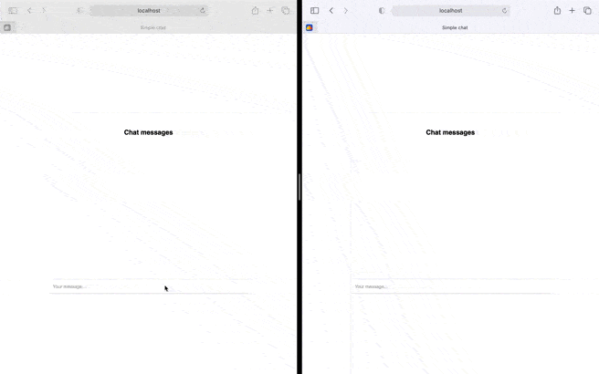

# Installation and launch

```bash
git clone https://github.com/khotsevich/sse-chat.git # Clone repository
npm install # Install third party modules
npm start # Run the application
```

Open 2 browser tabs at http://localhost:5000 and test the application

